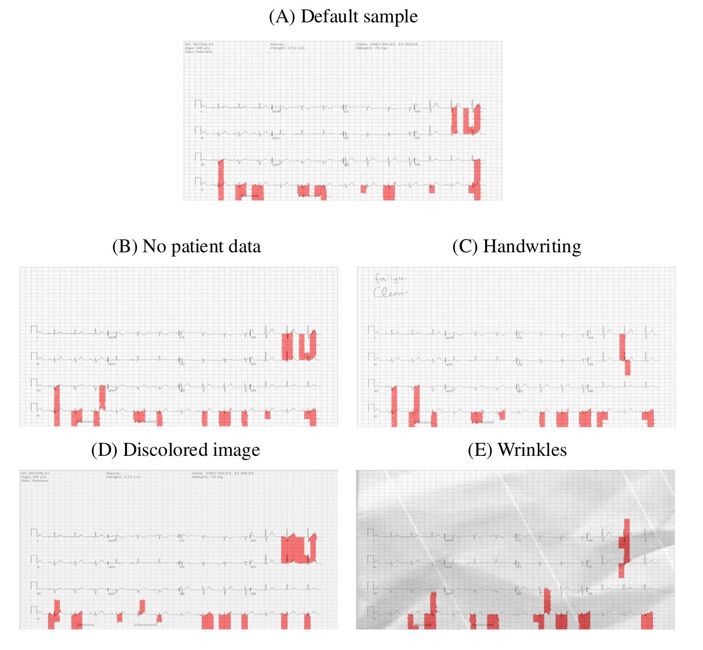
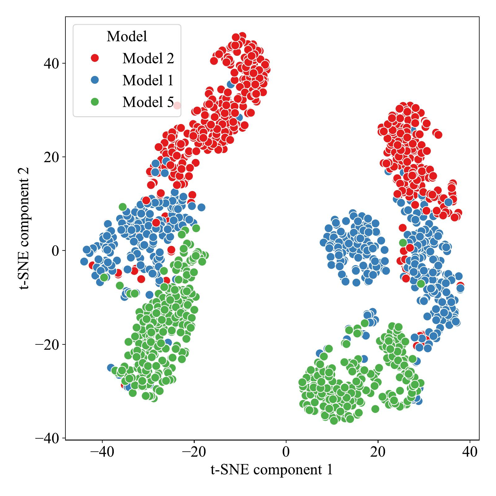
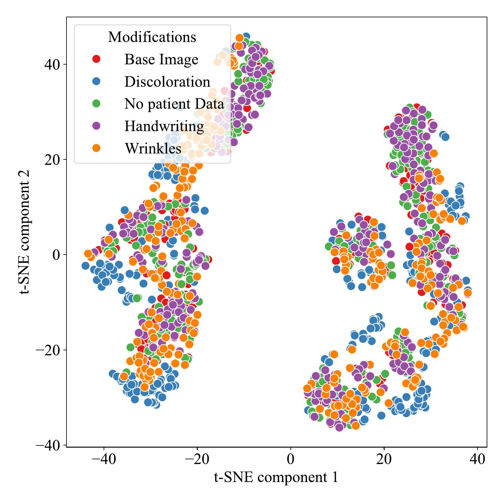

# Detecting Cardiovascular Diseases Using ECG Scans and~Explainable Artificial Intelligence: Code Repository

This repository provides tools for ECG image generation, deep learning-based classification, and explanation robustness analysis. It covers the full workflow from rendering ECG waveforms to images, applying real-world distortions, generating XAI explanations, and measuring their stability.

## Classification Models

Three independently trained classifiers for multi-label cardiovascular diagnosis:

| Architecture | Description |
|---|---|
| ResNet1D | Residual network adapted for 1D ECG signals (Wang et al.) |
| Inception1D | Multi-scale 1D inception modules for temporal pattern capture |
| ConvTransformer | Hybrid convolutional–transformer architecture for long-range dependencies |

Models are trained with 10-fold cross-validation on PTB-XL. Fold 10 is the test set.

## Augmentation Scenarios

Each scenario simulates a different condition of paper ECG digitization:

| Scenario | Description | Rationale |
|---|---|---|
| `clear` | Clean rendering, no artifacts | Baseline reference |
| `no_header` | Header metadata removed | Isolates waveform signal |
| `text` | Synthetic handwritten text overlay | Simulates clinical annotations |
| `wrinkles` | Paper wrinkles and creases via texture synthesis | Simulates physical degradation |
| `all` | Combined grid, padding, rotation, color randomization | Full digitization variability |
| `all_stacked` | Union of all augmentations (all + text + wrinkles) | Worst-case degradation |
| `dewarped` | Wrinkled images processed with Fourier-based correction | Tests artifact removal efficacy |

## Dewrinkling

The `dewarped` scenario takes wrinkled ECG images and cleans them using Fourier-domain processing, to test whether post-processing can recover explanation stability.

The cleaning works in six steps:

1. **Red grid extraction** — Separates the red ECG grid from the trace signal using a colour heuristic (`R − 0.5(G + B)`). The grid gets set aside so it can be added back later.

2. **FFT notch filtering** — Runs a 2D FFT on the greyscale image. Finds periodic peaks from leftover grid lines and suppresses them with Gaussian notch filters.

3. **Wrinkle flattening** — Estimates the low-frequency background (cutoff=120 px) in the Fourier domain and divides it out. This removes the slow illumination gradients that wrinkles and creases produce.

4. **Contrast enhancement** — Stretches the histogram: white-point at 99th percentile, gamma correction to brighten the paper, black-point at 1st percentile to darken traces.

5. **Trace boldening** — Reinforces thin ECG traces using morphological dilation, blended within a trace mask so the paper background stays clean.

6. **Grid re-compositing** — Converts back to RGB and blends the original red grid back in.

```bash
# Run dewrinkling on wrinkled images
uv run python augmentation_generation/scripts/dewarp_ecg_batch.py \
    augmentation_generation/output/wrinkles \
    augmentation_generation/output/dewarped

# With debug output (saves intermediate images for each stage)
uv run python augmentation_generation/scripts/dewarp_ecg_batch.py \
    augmentation_generation/output/wrinkles \
    augmentation_generation/output/dewarped --debug
```

## Results

### LIME Explanations for ECG Scans with Different Manipulations



### IoU Scores (mean ± 95% CI, N=100)

The robustness of explanations is analyzed using Intersection over Union (IoU) metrics across image modifications:

| Id | Discolored | No metadata | Handwriting | Wrinkles | Average IoU |
|---|---|---|---|---|---|
| Model 1 | 0.220 ± 0.015 | 0.376 ± 0.025 | 0.345 ± 0.021 | 0.266 ± 0.020 | 0.302 ± 0.016 |
| Model 2 | 0.170 ± 0.013 | 0.553 ± 0.019 | 0.524 ± 0.018 | 0.215 ± 0.011 | 0.366 ± 0.010 |
| Model 5 | 0.319 ± 0.020 | 0.499 ± 0.030 | 0.456 ± 0.025 | 0.324 ± 0.020 | 0.399 ± 0.019 |

### Dewarped vs Wrinkles

| Id | Dewarped | Wrinkles | Kruskal-Wallis *p* |
|---|---|---|---|
| Model 1 | 0.250 ± 0.018 | 0.266 ± 0.020 | < 10⁻¹⁸ |
| Model 2 | 0.194 ± 0.010 | 0.215 ± 0.011 | < 10⁻¹⁸ |
| Model 5 | 0.328 ± 0.020 | 0.324 ± 0.020 | < 10⁻¹⁸ |

### PyRadiomics Feature Analysis

Image features extracted from explanations help assess model stability:

**PyRadiomics features vs model used**



**PyRadiomics features vs type of manipulation**



## Data

**[PTB-XL](https://physionet.org/content/ptb-xl/1.0.3/)** — 21,799 clinical 12-lead ECG recordings (10 s, 500 Hz) from 18,869 patients. 10-fold stratified splits; fold 10 is the test set.

## Pipeline Architecture

```
       PTB-XL WFDB waveforms
               │
               ▼
┌──────────────────────────────────────┐
│  Stage 1 · Data Preparation          │  Download PTB-XL, extract fold-10
│  augmentation_generation/            │  test-set WFDB records
└──────────────┬───────────────────────┘
               ▼
┌──────────────────────────────────────┐
│  Stage 2 · ECG Image Rendering       │  Render waveforms to images under
│  augmentation_generation/            │  7 augmentation scenarios
└──────────────┬───────────────────────┘
               ▼
┌──────────────────────────────────────┐
│  Stage 3 · Custom Augmentation       │  (Optional) Apply user-defined
│  single_augmentation/                │  augmentation chains via JSON config
└──────────────┬───────────────────────┘
               ▼
┌──────────────────────────────────────┐
│  Stage 4 · XAI Explanation           │  5 methods × 3 models × N scenarios
│  explanation_generation/             │  → NPZ explanation arrays
└──────────────┬───────────────────────┘
               ▼
┌──────────────────────────────────────┐
│  Stage 5 · Radiomics Extraction      │  PyRadiomics features from each
│  radiomics/                          │  explanation map (batched, parallel)
└──────────────┬───────────────────────┘
               ▼
┌──────────────────────────────────────┐
│  Stage 6 · Statistical Analysis      │  Feature aggregation, IoU matrices,
│  radiomics/                          │  robustness statistics
└──────────────────────────────────────┘
```

## Requirements

| Dependency | Version | Purpose |
|---|---|---|
| [uv](https://docs.astral.sh/uv/) | latest | Python package management (all modules) |
| Python | 3.10 | `augmentation_generation`, `single_augmentation`, `explanation_generation` |
| Python | >= 3.12 | `radiomics` |
| [Weights & Biases](https://wandb.ai/) | — | Model artifact storage and experiment tracking |
| CUDA (optional) | >= 11.7 | GPU-accelerated explanation generation |

Each module has its own `pyproject.toml`, resolved by `uv`.

## Reproduction

### 1. Environment Setup

```bash
# Configure W&B credentials for model artifact retrieval
cp explanation_generation/.env.example explanation_generation/.env
# → set WANDB_API_KEY in the .env file

# (Optional) Install uv if not present
curl -LsSf https://astral.sh/uv/install.sh | sh
```

### 2. Model Configuration

Update W&B model artifact references in:
- `explanation_generation/run_all.sh` — `MODELS` array
- `explanation_generation/configs/xai_local.json` — `model` field

These should point to your trained model artifacts in W&B.

### 3. Full Pipeline Execution

```bash
# Run all six stages end-to-end
bash pipeline.sh

# Preview commands without execution
bash pipeline.sh --dry-run

# Resume from a specific stage
bash pipeline.sh --from-stage 4

# Run a single stage in isolation
bash pipeline.sh --only-stage 2
```

### 4. Custom Augmentation Experiments

Stage 3 supports user-defined augmentation chains via JSON configuration:

```bash
bash pipeline.sh --only-stage 3 \
    --stage3-config single_augmentation/configs/example_config.json \
    --stage3-input  augmentation_generation/output/clear \
    --stage3-output single_augmentation/output
```

See `single_augmentation/configs/` for examples.

## Structure

### `augmentation_generation/`

Renders PTB-XL waveforms into ECG images and applies augmentations. Also handles Fourier-based dewrinkling.

```bash
cd augmentation_generation
uv run python prepare_fold10_inputs.py      # Extract fold-10 WFDB records
bash run_all_scenarios.sh                    # Generate all 7 scenarios
```

**Outputs:** `output/<scenario>/` — PNG images organized by augmentation scenario.

### `single_augmentation/`

Applies configurable augmentation steps to existing ECG images via JSON config.

```bash
cd single_augmentation
uv run python apply_augmentations.py \
    --input_dir <images> --output_dir <output> \
    --config configs/example_config.json
```

### `explanation_generation/`

Pulls trained models from W&B and generates XAI explanation maps using Captum. Outputs NPZ files.

```bash
cd explanation_generation
uv run python generate_explanations.py \
    --config_file configs/xai_local.json \
    --output_dir ./outputs \
    --from_index 0 --to_index 100

# Full combinatorial run (3 models × 7 augmentations):
bash run_all.sh
```

**Outputs:** `outputs/` — NPZ files containing explanation arrays per sample, method, and model.

### `radiomics/`

Extracts radiomics features from explanation maps and computes IoU between methods.

```bash
cd radiomics
uv run python generate_paths.py                          # Build path manifest
uv run python main.py -f 0 -t 200 -p batch1              # Extract features (batch)
uv run python calculate_stats.py \
    --npz_dir statystyki/explanations2 \
    --csv_dir output --output_dir results                 # Aggregate statistics
```

**Outputs:** Per-sample radiomics CSVs, aggregated feature statistics, IoU matrices.

## Repository Structure

```
.
├── pipeline.sh                                 # End-to-end pipeline orchestrator
├── README.md
│
├── augmentation_generation/
│   ├── pyproject.toml
│   ├── run_all_scenarios.sh
│   ├── prepare_fold10_inputs.py
│   ├── scripts/
│   │   ├── run_generation_{all,clear,text,...}.sh
│   │   └── dewarp_ecg_batch.py
│   └── ecg-image-kit/codes/ecg-image-generator/
│       ├── gen_ecg_images_from_data_batch.py
│       ├── ecg_plot.py, extract_leads.py, helper_functions.py
│       ├── config.yaml
│       ├── CreasesWrinkles/creases.py
│       ├── HandwrittenText/generate.py
│       ├── ImageAugmentation/augment.py
│       └── TemplateFiles/generate_template.py
│
├── single_augmentation/
│   ├── pyproject.toml
│   ├── apply_augmentations.py
│   └── configs/*.json
│
├── explanation_generation/
│   ├── pyproject.toml
│   ├── generate_explanations.py
│   ├── run_all.sh
│   ├── .env.example
│   ├── configs/
│   │   ├── xai_local.json
│   │   ├── xai_labels.csv
│   │   └── explainers/basic_explainers.json
│   ├── src/
│   │   ├── registry.py
│   │   ├── lit_models/ptbxl_model.py
│   │   ├── data/{ptb_xl_multiclass_datamodule,folded_df_image_data_module,...}.py
│   │   ├── models/{resnet1d,inception1d,conv_transformer,basic_conv1d,...}.py
│   │   ├── utils/{metrics,preprocessing,format}.py
│   │   └── modules/gev.py
│   └── compact_xai/EnsembleXAI/
│       ├── Ensemble.py
│       ├── Normalization.py
│       └── Metrics.py
│
└── radiomics/
    ├── pyproject.toml
    ├── main.py
    ├── calculate_stats.py
    ├── generate_paths.py
    ├── run.sh
    └── statystyki/config.yml
```
